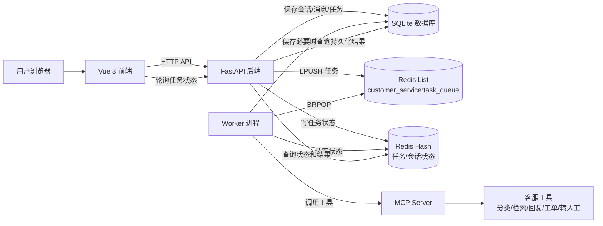
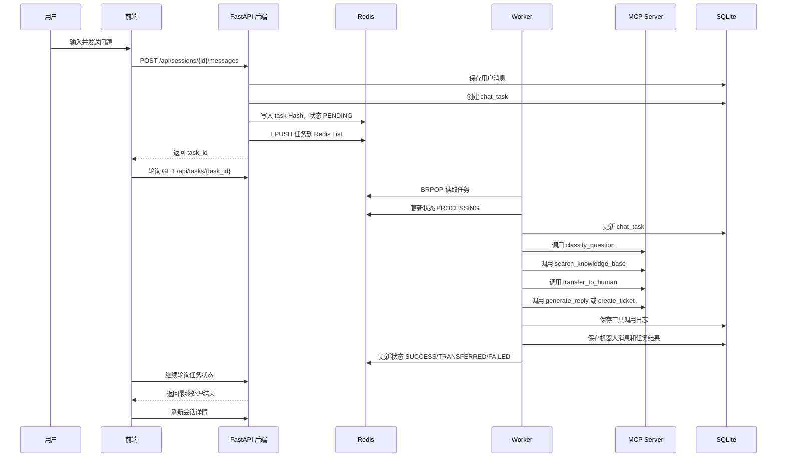
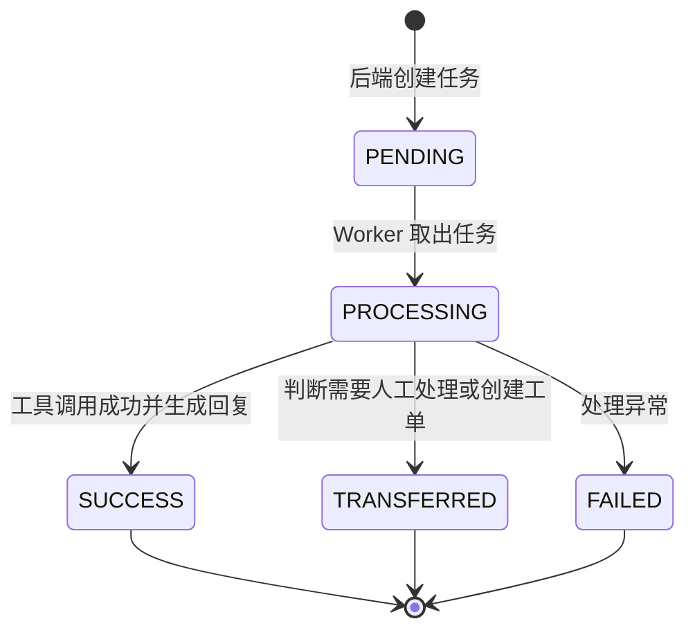

# 系统架构设计

## 1. 系统总体架构

本系统采用前后端分离和异步任务处理架构。前端通过 HTTP API 调用后端，后端负责会话、消息和任务创建。Redis 作为中间件，承担任务队列、任务状态缓存和会话最近状态缓存。Worker 进程从 Redis List 中阻塞读取任务，调用 MCP Server 暴露的工具完成客服处理，并将结果写入 SQLite。

## 2. 各模块职责

### 2.1 前端 Vue

- 提供聊天页面；
- 展示会话列表；
- 提交用户问题；
- 根据 `task_id` 轮询任务状态；
- 展示机器人回复、分类结果、知识库命中和转人工结果；
- 提供后台演示页查看任务和工具日志。

### 2.2 后端 FastAPI

- 提供 REST API；
- 创建和查询客服会话；
- 保存用户消息；
- 创建任务记录；
- 写入 Redis 任务状态；
- 将任务 JSON 写入 Redis List；
- 查询任务和工具调用日志。

### 2.3 Redis

- `customer_service:task_queue`：Redis List，保存待处理任务；
- `customer_service:task:{task_id}`：Redis Hash，保存任务最新状态；
- `customer_service:session:{session_id}`：Redis Hash，保存会话最近状态。

### 2.4 Worker

- 使用 `BRPOP` 阻塞读取 Redis List；
- 将任务状态更新为 `PROCESSING`；
- 调用 MCP 工具；
- 保存工具调用日志；
- 保存机器人消息；
- 更新任务最终状态。

### 2.5 MCP Server

- 封装智能客服工具能力；
- 提供分类、知识库检索、回复生成、工单创建和转人工判断工具；
- 当前使用规则和模板实现；
- 后续可替换为真实 LLM API 调用。

### 2.6 SQLite

- 持久化保存会话、消息、任务、工具调用日志和工单；
- 作为演示查询和结果验证的数据来源。

## 3. 系统架构图

## 4. 用户发送消息后的处理流程

## 5. 任务状态流转图

## 6. 架构设计说明

本架构通过 Redis List 将后端请求和客服处理过程解耦。后端只负责快速响应用户提交，耗时处理由 Worker 完成。Redis Hash 保存任务状态，使前端可以通过轮询快速看到任务进度。SQLite 保存完整历史，便于课堂展示和结果验证。MCP Server 将工具能力独立封装，体现 AI 工具调用中间层的设计思想。
