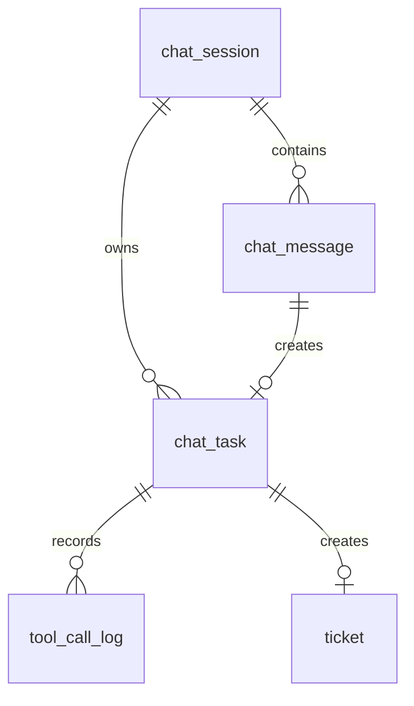

# 数据库设计

## 1. 数据库选择

本项目使用 SQLite 作为本地持久化数据库。SQLite 不需要额外数据库服务，适合课程大作业和本地演示。数据库文件计划存放在 `backend/app.db` 或通过配置项指定路径。

## 2. 数据表说明

系统至少包含以下数据表：

- `chat_session`：客服会话表；
- `chat_message`：聊天消息表；
- `chat_task`：客服处理任务表；
- `tool_call_log`：MCP 工具调用日志表；
- `ticket`：工单表。

## 3. chat_session 表

`chat_session` 用于保存一次客服会话的基本信息。

| 字段名 | 类型 | 说明 |
| --- | --- | --- |
| id | Integer | 主键 |
| title | String | 会话标题 |
| status | String | 会话状态，如 ACTIVE、CLOSED |
| last_message | Text | 最近一条消息摘要 |
| created_at | DateTime | 创建时间 |
| updated_at | DateTime | 更新时间 |

## 4. chat_message 表

`chat_message` 用于保存用户消息和机器人回复。

| 字段名 | 类型 | 说明 |
| --- | --- | --- |
| id | Integer | 主键 |
| session_id | Integer | 所属会话 ID |
| role | String | 消息角色，USER 或 ASSISTANT |
| content | Text | 消息内容 |
| task_id | String | 关联任务 ID，可为空 |
| created_at | DateTime | 创建时间 |

关系说明：一个 `chat_session` 可以包含多条 `chat_message`。

## 5. chat_task 表

`chat_task` 用于保存客服处理任务。

| 字段名 | 类型 | 说明 |
| --- | --- | --- |
| id | String | 任务 ID，使用 UUID |
| session_id | Integer | 所属会话 ID |
| user_message_id | Integer | 用户消息 ID |
| status | String | PENDING、PROCESSING、SUCCESS、FAILED、TRANSFERRED |
| category | String | 问题分类 |
| knowledge_hit | Text | 知识库命中结果，JSON 字符串 |
| result | Text | 最终回复或处理结果 |
| error_message | Text | 错误信息 |
| transferred | Boolean | 是否转人工 |
| ticket_id | Integer | 关联工单 ID，可为空 |
| created_at | DateTime | 创建时间 |
| updated_at | DateTime | 更新时间 |

关系说明：一条用户消息通常对应一个 `chat_task`。

## 6. tool_call_log 表

`tool_call_log` 用于记录 Worker 调用 MCP 工具的过程。

| 字段名 | 类型 | 说明 |
| --- | --- | --- |
| id | Integer | 主键 |
| task_id | String | 所属任务 ID |
| tool_name | String | 工具名称 |
| input_json | Text | 工具输入，JSON 字符串 |
| output_json | Text | 工具输出，JSON 字符串 |
| success | Boolean | 调用是否成功 |
| error_message | Text | 错误信息 |
| created_at | DateTime | 创建时间 |

关系说明：一个 `chat_task` 可以对应多条 `tool_call_log`。

## 7. ticket 表

`ticket` 用于保存需要人工处理的问题。

| 字段名 | 类型 | 说明 |
| --- | --- | --- |
| id | Integer | 主键 |
| task_id | String | 来源任务 ID |
| session_id | Integer | 所属会话 ID |
| title | String | 工单标题 |
| description | Text | 工单描述 |
| status | String | 工单状态，如 OPEN、CLOSED |
| created_at | DateTime | 创建时间 |
| updated_at | DateTime | 更新时间 |

## 8. 表关系说明

## 9. 初始化数据说明

数据库初始化时创建所有表，不强制写入业务数据。知识库数据不放在数据库中，而是使用 `backend/data/knowledge_base.json` 保存，便于 MCP 工具和 Worker 读取。

知识库初始分类包括：

- 技术问题：登录失败、打不开、报错、无法使用；
- 售后退款问题：退款流程、费用说明；
- 售前咨询：产品功能、价格和购买方式；
- 商品咨询：商品、课程、服务和套餐介绍；
- 问候闲聊：普通问候和接待说明；
- 无效输入：纯数字或过短且不可识别的内容；
- 投诉或转人工：多次反馈无人处理、投诉、人工客服。

后续如需扩展，可以将知识库迁移到数据库表或向量数据库，但本次大作业保持 JSON 文件方式。
