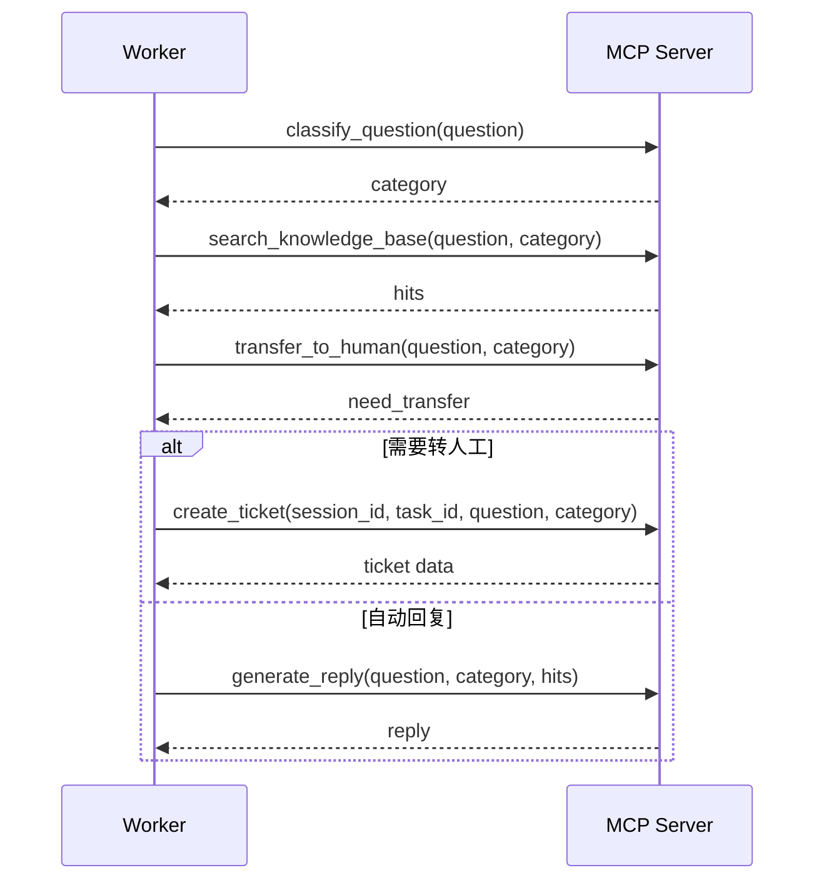

# MCP 工具设计

## 1. MCP Server 的职责

MCP Server 作为 AI 工具调用中间层，负责将智能客服需要的工具能力封装成统一接口。Worker 不直接实现分类、检索、回复生成和工单创建逻辑，而是通过 MCP 工具完成。

本项目采用“规则兜底 + 可选大模型增强”的方式实现智能处理能力。未配置大模型时，系统使用规则和模板保证本地演示稳定；配置 OpenAI 兼容接口后，问题分类、转人工判断和回复生成会优先使用大模型辅助完成，并在调用失败时自动回退到规则结果。

## 2. MCP 工具列表

| 工具名称 | 作用 |
| --- | --- |
| `classify_question` | 根据关键词初步分类，并可由大模型辅助二次判断 |
| `search_knowledge_base` | 根据分类和问题内容检索本地知识库 |
| `generate_reply` | 根据分类和知识库命中结果生成客服回复，可由大模型增强表达 |
| `create_ticket` | 为需要人工处理的问题创建工单信息 |
| `transfer_to_human` | 根据规则和可选大模型判断问题是否需要转人工 |

## 3. classify_question

### 3.1 输入

```json
{
  "question": "我想退款，怎么处理？"
}
```

### 3.2 输出

```json
{
  "category": "售后退款问题",
  "reason": "命中关键词：退款"
}
```

### 3.3 规则

- 包含“退款、退钱、价格、费用” -> 售后退款问题；
- 包含“无法登录、打不开、报错、不能使用” -> 技术问题；
- 包含“人工、投诉、没人处理、太差” -> 投诉或转人工；
- 包含“怎么购买、多少钱、功能” -> 售前咨询；
- 其他 -> 一般问题。

规则结果作为兜底结果。若 `.env` 中启用 `LLM_ENABLE=true` 且配置了 `LLM_API_KEY`、`LLM_MODEL`，工具会把用户问题、规则分类和固定分类枚举交给大模型二次判断。大模型只能从固定分类中选择，避免返回不可控分类名称。

## 4. search_knowledge_base

### 4.1 输入

```json
{
  "question": "我买了课程但是一直打不开，应该怎么办？",
  "category": "技术问题"
}
```

### 4.2 输出

```json
{
  "hits": [
    {
      "title": "课程打不开处理建议",
      "content": "请检查网络、浏览器缓存和账号权限。"
    }
  ]
}
```

### 4.3 实现方式

知识库保存在 `backend/data/knowledge_base.json`。MCP 工具按分类和关键词匹配返回候选内容。为了减少重复维护，Worker 和 MCP 工具均使用同一份知识库文件。

## 5. generate_reply

### 5.1 输入

```json
{
  "question": "我想退款，怎么处理？",
  "category": "售后退款问题",
  "knowledge_hits": [
    {
      "title": "退款流程说明",
      "content": "请在订单页面提交退款申请。"
    }
  ]
}
```

### 5.2 输出

```json
{
  "reply": "您的问题属于售后退款问题。请在订单页面提交退款申请，系统会根据课程使用情况进行审核。",
  "used_knowledge": true
}
```

### 5.3 实现方式

未配置大模型时，通过模板拼接生成回复。配置大模型后，工具会将用户问题、分类、知识库命中和是否转人工等信息组合为 Prompt，由 LLM 生成更自然的回复。若 LLM 调用失败或返回内容为空，系统自动回退到模板回复。

## 6. create_ticket

### 6.1 输入

```json
{
  "session_id": 1,
  "task_id": "9a64b2f4-32f0-4f43-89cb-b3a6e2e7c001",
  "question": "我已经反馈三次了，没人处理，我要人工客服。",
  "category": "投诉或转人工"
}
```

### 6.2 输出

```json
{
  "title": "投诉或转人工处理工单",
  "description": "用户反馈：我已经反馈三次了，没人处理，我要人工客服。",
  "status": "OPEN"
}
```

### 6.3 实现方式

MCP 工具只生成工单信息，实际入库由 Worker 完成。这样可以保持数据库操作集中在 Worker，避免 MCP Server 直接依赖业务数据库。

## 7. transfer_to_human

### 7.1 输入

```json
{
  "question": "我已经反馈三次了，没人处理，我要人工客服。",
  "category": "投诉或转人工"
}
```

### 7.2 输出

```json
{
  "need_transfer": true,
  "reason": "问题包含人工或投诉相关关键词"
}
```

### 7.3 实现方式

当前先按分类和关键词判断是否转人工。配置大模型后，工具会把规则判断结果和用户问题交给大模型辅助确认。后续可以增加规则权重、历史投诉次数、用户等级等条件。

## 8. MCP 工具调用流程



## 9. 大模型配置与兜底方式

MCP Server 支持 OpenAI 兼容接口，配置项如下：

```text
LLM_ENABLE=false
LLM_API_KEY=
LLM_BASE_URL=
LLM_MODEL=
LLM_TIMEOUT_SECONDS=20
```

说明：

1. `LLM_ENABLE=false` 时，系统完全使用规则和模板；
2. `LLM_ENABLE=true` 但缺少 API Key 或模型名时，系统自动回退规则和模板；
3. 大模型调用失败时，工具返回规则结果，并附带 `llm_error`；
4. 工具输出包含 `llm_used` 和 `fallback_used` 字段，便于 Worker 后续记录工具调用日志；
5. 不提交真实 API Key，实际密钥只写入本地 `.env`。

这种设计既可以体现大模型辅助客服判断和回复生成，也能保证本地演示链路不依赖外部服务。
